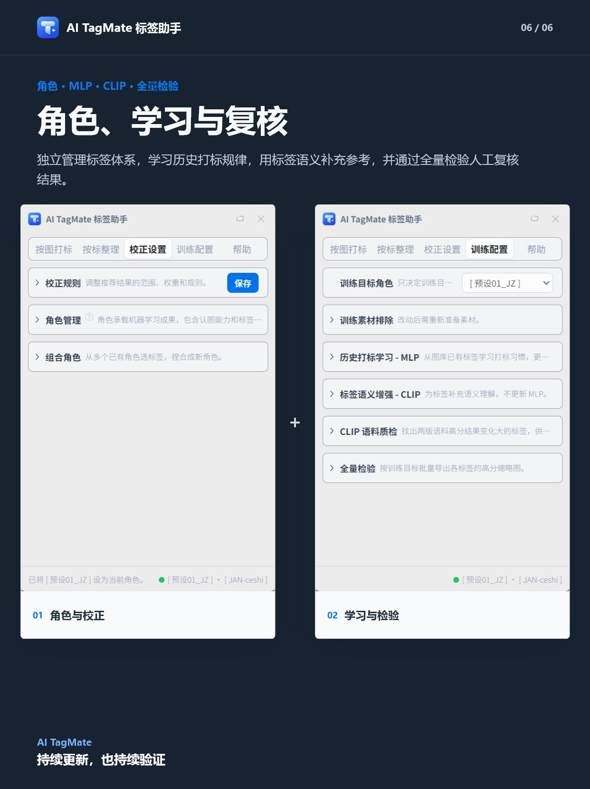

# AI TagMate 标签助手

给 Eagle 图库使用的本地视觉标签与文件夹整理助手。

TagMate 会分析画面，结合历史打标习惯、标签定义和校正规则推荐标签，并通过标签关联文件夹完成分类。支持单图和批量处理，推荐标签默认由你确认后写入。图片、标签、学习和推荐都在本机完成，不会上传。

AI TagMate is a local-first AI tagging, visual similarity search, and image organization plugin for the Eagle image library app. It uses DINOv2 (visual feature extraction) to understand image appearance, MLP (tagging-pattern learning) to learn from your tagging history, and CLIP (tag-semantic alignment) to connect images with tag meanings. It provides tag recommendations, similar-image retrieval, batch tagging, and tag-linked folder organization. All image analysis and model training run locally on Windows; your images, tags, and learning data are not uploaded.

  

## 主要功能

- **按图打标**：在 Eagle 中选择一张或多张图片，获取标签推荐，调整后确认写回。
- **按标整理**：支持以图找图、按标签筛选候选图、查找高分未打和低分误打图片。
- **自定义学习**：从已有标签样本中学习你的打标习惯，让推荐贴近自己的标签体系。
- **角色管理**：支持使用预设角色，也可以新建、导入、导出和组合其他角色。
- **结果校正**：通过推荐范围、排序权重、互斥、降权和阈值调整推荐结果。

## 功能展示

查看完整功能展示（5 张）

  

  

  

  

  

## 内置的角色能做什么？

内置角色包含 146 个标签，意味着本地工具已经学会这些概念，能够对陌生图完成这些概念的识别、推荐、取图等。它不是覆盖所有题材的万能识别库。比如人物、服饰、食品、动植物等专业细分类别，需要导入其他角色或学习自己的图库形成学习成果。

- **建筑与空间**：建筑、室内、庭院、街道、住宅、办公、商业、教育、酒店、大厅、走廊等。
- **景观与室外**：乔木、灌木、水体、花池、铺地、围墙、观景、城市景观等。
- **材料与构造**：木、砖、石材、玻璃、金属、混凝土、陶板、格栅、门窗等。
- **家具与设施**：座椅、桌、沙发、书架、导视、灯光、装置、游乐设施等。
- **设计表达**：总平、平面、立面、剖面、功能分析、流线分析、排版、海报、色卡、效果参考等。

## 功能原理

TagMate 的推荐过程可以理解为“看图 + 学习惯 + 对语义 + 规则校正”：系统先分析图片画面，由历史打标学习掌握你的分类思路和用词习惯，再用标签语义提供补充参考，最后通过推荐范围、排序权重、互斥、降权和阈值等校正设置整理结果。它给出的不是一套固定的通用答案，而是尽量贴近你自己的标签体系和判断方式。

## 先了解这几个概念

- **历史打标学习**：从已有图库中读懂你的分类思路和用词习惯，掌握你对画面的判断方式，给出更贴近个人习惯的推荐。
- **标签语义增强**：理解标签含义，为推荐补充语义参考。
- **角色**：把一套标签体系和学习成果保存成可使用、可导入、可分享的完整方案。你可以为不同题材建立不同角色；内置角色主要面向建筑摄影实景，每次启用一个。
- **组合角色**：从多个角色中挑出需要的标签，轻松组成更适合当前用途的新角色。
- **校正设置**：通过推荐范围、排序权重、互斥、降权和阈值细调结果，让推荐更贴近你的判断。

## 第一次使用先做什么？

1. 打开插件，在 Eagle 选一张图，点击“获取推荐”。（注意：目前内置的能力对建筑实景表现更好。）
2. 到“训练配置” → “历史打标学习 - MLP” → “生成 DINOv2 图库特征”。让系统认一遍图库并形成缓存，之后就可以正常使用“找相似”或“按标签取图”，推荐速度也会变快。
3. 点击“获取推荐”旁边的“？”可以进入引导页面。点击帮助页中“使用指南”旁的“？”，打开完整指南手册。

## 下载与安装

### 在线安装

适合尚未安装插件、网络较稳定的用户。

1. 下载 [tagmate-frontend.eagleplugin](https://github.com/ZSTDJan/tagmate-releases/releases/latest/download/tagmate-frontend.eagleplugin)。
2. 双击文件，在 Eagle 中确认安装。
3. 打开 AI TagMate 标签助手，按首次启动提示下载并运行后端安装程序。
4. 有 NVIDIA 显卡选择 GPU；没有 NVIDIA 显卡选择 CPU。

### 完整离线安装

适合插件已安装但后端自动下载失败、网络不稳定或需要断网安装的用户。离线包包含 Eagle 插件、CPU/GPU 运行环境、模型和后端安装程序，必须下载整个文件夹，不能只下载里面的 `.eagleplugin`。

- [百度网盘](https://pan.baidu.com/s/1zOUqXBNUIKy8rpCk7QhTxw?pwd=k7z8)，提取码：`k7z8`
- [123 网盘](https://1860511954.share.123pan.cn/123pan/JEs5vd-BLYLh)

完整解压后，运行 `AI TagMate 标签助手-后端安装程序.exe`。不要移动或删除“安装数据”中的文件。安装结束时可安装或更新 Eagle 插件；如果没有出现 Eagle 确认窗口，请双击 `Eagle端插件安装文件.eagleplugin`。

本免费工具没有使用付费代码签名，Windows 可能显示“未知发布者”或 SmartScreen 提示。请只从本页面列出的链接下载安装。

## 系统要求

- Windows 10/11 64 位
- Eagle 4.0+
- NVIDIA GPU 可选；有 NVIDIA 显卡时推荐使用 GPU
- 使用本机固定磁盘，建议 SSD；不支持网络路径、移动盘或磁盘根目录
- GPU 安装预留至少 9 GB，CPU 安装预留至少 5 GB；离线包本身约 5.30 GB（网盘页面显示约 4.93 GB）

## 常见问题

**在线安装和完整离线包应该选哪个？**

网络稳定时可以只下载 Eagle 插件，首次打开后按提示下载安装本地后端。网络不稳定或需要断网安装时，下载完整离线包；两种方式安装的是同一套功能。

**为什么安装 Eagle 插件后还需要安装本地后端？**

Eagle 插件负责界面和操作，本地后端负责图片分析、推荐、训练和模型运行。后端安装完成后，日常使用不依赖云端服务。

**第一次使用能直接推荐吗，内置角色适合哪些图片？**

可以。当前内置角色主要面向建筑摄影实景，这类图片可以直接获取推荐；其他专业内容需要导入合适的角色，或让 TagMate 学习自己的图库。

**其他专业或自己的标签体系能不能使用？**

可以。你可以新建角色并使用已有标签样本进行学习，也可以导入、导出、分享或组合其他角色。

**推荐结果会不会直接修改 Eagle 中的标签和文件夹？**

获取推荐本身不会写回。标签和通过标签气泡选择的文件夹会在你确认后写入；通过图片文件夹面板进行的文件夹操作会立即生效。

**图片、标签和训练数据会不会上传？**

不会。图片分析、标签、学习和推荐均在本机完成；在线版只在首次安装或更新程序文件时需要联网下载。

## 联系与反馈

- QQ 群：[点击链接加入群聊【AI TagMate 内测】](https://qm.qq.com/q/N60iPASGI0)
- 问题反馈：[GitHub Issues](https://github.com/ZSTDJan/tagmate-releases/issues)

## 使用许可

本软件供个人免费使用，但不开放源码。本仓库只存放公开安装文件和使用说明。

Copyright (c) 2026 ZSTDJan. All rights reserved.
